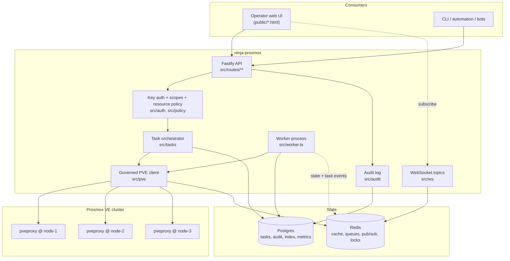
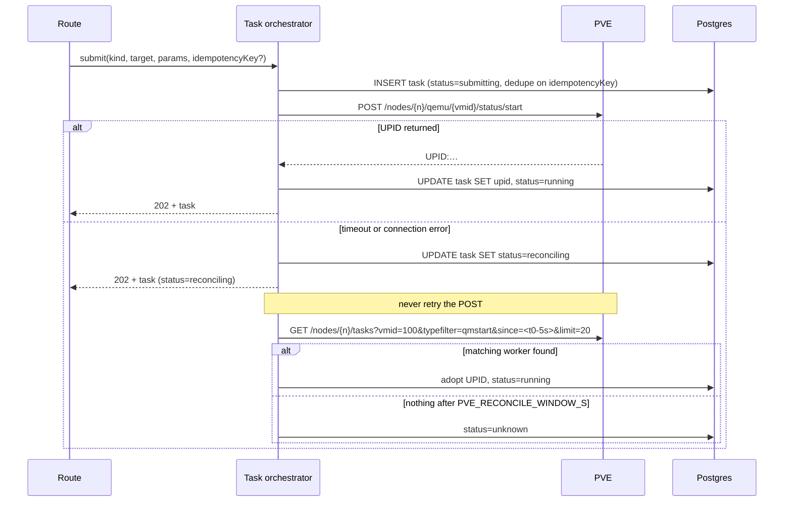
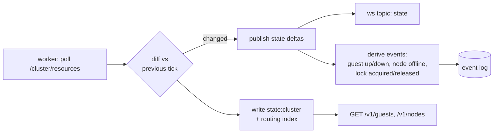

# ninja-proxmox — design and delivery plan

Draft v0.1 · 2026-09-07 · status: **not yet implemented**

This is the *what and why* document for the whole service. It is written to be
buildable from: every section that constrains code says which constraint and
why. Where a decision was forced by something Proxmox does, the constraint is
numbered (`C1`…`C11`) in §3 and cited at the point of impact.

Companion: [proxmox-api-surface.md](proxmox-api-surface.md) — the upstream
endpoint map, one row per PVE call we intend to make.

---

## 1. What this is

A self-hosted control plane in front of **one Proxmox VE cluster**. Downstream
consumers — the operator web UI, a CLI, automation, a Discord bot — talk to
ninja-proxmox. Only ninja-proxmox talks to `pveproxy`.

|                              |                                                                                                                                                     |
| ---------------------------- | --------------------------------------------------------------------------------------------------------------------------------------------------- |
| **Hide the PVE credential**  | The API token exists in exactly one place: this service's environment. No browser, script or downstream project ever holds it.                       |
| **Make mutations legible**   | Every PVE mutation is a fire-and-forget worker task (C1). We turn that into a first-class, queryable, subscribable job with history and an owner.    |
| **Protect the cluster**      | `pvedaemon` has a small fixed worker pool (C2). A naive client fans out and wedges the host's own UI. One governed client, one concurrency budget.   |
| **Narrow the blast radius**  | The PVE API will happily destroy a VM on one unauthenticated-by-policy call. We put scopes, resource policy, confirmation tokens and an audit log in front of it. |
| **One stable contract**      | Guest shape, task shape and error shape stay put across PVE upgrades. When Proxmox moves something, it is fixed once, here.                          |

### Goals

- A complete **operator surface**: guest lifecycle (QEMU + LXC), snapshots,
  backup and restore, migration, cloning, config edits, storage, node and
  cluster health, task history, metrics, and console.
- A **safe** API: nothing destructive happens by accident, and everything that
  happens is attributable to a key and recorded.
- A **legible** API: synchronous-looking reads, explicitly asynchronous writes,
  one error envelope, an OpenAPI document generated from the route schemas.
- A **web UI** that an operator would actually reach for over the PVE UI for
  day-to-day work — fast, live, keyboard-driven, safe by default.

### Non-goals

- Replacing the Proxmox web UI. Cluster formation, node join/leave, disk and
  ZFS pool creation, certificate management, repository and update management,
  and the shell stay over there. We are a control plane, not an installer.
- Managing more than one cluster. The credential store is keyed by node so this
  is not a dead end, but multi-cluster routing, cross-cluster UI and per-cluster
  policy are explicitly out of v1.
- Writing to `/etc/pve` or any node filesystem outside the API.
- Being a Proxmox Backup Server admin tool. We trigger backups, list them and
  restore from them; PBS retention, pruning and datastore administration stay
  in PBS.

---

## 2. Decisions taken up front

| Decision | Choice | Why |
| --- | --- | --- |
| Upstream auth | **API tokens only** | No password at rest, revocable independently of the user, no ticket-refresh state machine, and no CSRF token to thread (C9). Cost: console needs its own credential — see §15. |
| Downstream auth | **Bearer API keys, sha256-hashed, scoped** | Same pattern as `riot-proxy`; works identically for a browser, a CLI and a bot. |
| Topology | **One cluster, many nodes** | Node set is discovered, not configured (C4). |
| Stack | Node 26, Fastify 5, TypeBox, Drizzle + Postgres, Redis + BullMQ, undici, pino, prom-client | House stack. Matches `riot-proxy` so operational knowledge transfers. |
| UI | Single-file HTML in `public/`, no build step | Same as `riot-proxy`'s dev UI and dashboard. Edit and reload. |

---

## 3. Constraints that shape everything

These are properties of Proxmox VE, not of our design. Each one is cited later
where it forces a decision.

**C1 — Every mutation is asynchronous and returns a UPID, not a result.**
`POST /nodes/pve/qemu/100/status/start` returns `200` with a string like
`UPID:pve:0000A1B2:00A3C4D5:66E1F2A3:qmstart:100:svc@pve!ninja:`. That `200`
means *"a worker was forked"*, not *"the VM started"*. The VM may fail to start
a second later. Any API that reports success on this response is lying. This is
the single most important fact in the document; §7 is the response to it.

**C2 — `pvedaemon` runs a small, fixed worker pool** (three forked workers by
default). Concurrent API calls beyond that queue behind each other, and a client
that fans out aggressively will starve the cluster's own web UI and the CLI.
Our client is therefore *governed*, not merely rate-limited (§5.4).

**C3 — API tokens cannot authenticate the console WebSocket.** `vncproxy` and
`termproxy` accept a token, but the follow-on `/vncwebsocket` upgrade rejects
token auth — `pvedaemon` logs `value 'user@realm!tokenid' does not look like a
valid user name`. Only a `PVEAuthCookie` ticket from `/access/ticket` works.
Given the tokens-only decision, console is an **opt-in module with its own
credential**, off by default (§15).

**C4 — Guests are node-scoped, and their node changes.** Every guest call is
`/nodes/{node}/{qemu|lxc}/{vmid}/…`. There is no cluster-level guest endpoint.
Migration and HA failover move a guest without telling us. A stale `vmid → node`
map produces confident calls to the wrong node (§6).

**C5 — Guests carry a `lock`.** `backup`, `migrate`, `snapshot`, `rollback`,
`clone`, `create` set a lock; actions taken while locked fail with a terse
error. Lock state is part of the guest model and part of the UI, not an
afterthought.

**C6 — TLS is self-signed by default.** The homelab answer is usually
`rejectUnauthorized: false`, which throws away the transport's only defence on
the one connection that carries the most privileged credential we hold. We pin
a certificate fingerprint instead (§5.2).

**C7 — Errors are terse, inconsistent, and often `500`.** "VM is locked",
"already running", "no such VM", and a genuine internal fault all arrive
looking similar. Unmapped, they surface to users as an opaque 500. §5.5 maps
them.

**C8 — `/cluster/resources` is a cheap firehose.** One call returns every node,
guest, storage and pool with live status. Polling it once beats fanning out
per-guest, and respects C2. It is the backbone of the read path (§8).

**C9 — Tokens need explicit ACL grants, and privilege separation is on by
default.** A freshly created token with `privsep=1` has *no* permissions even
if its user is root. Its effective rights are the intersection of the user's
and the token's own ACL. This trips everyone once; the setup guide and
`npm run pve:check` exist to make it trip nobody twice.

**C10 — Some endpoints are async only sometimes.** `PUT .../config` returns a
UPID when the guest is running (the change goes through a worker) and `null`
when it is stopped. Code that assumes one or the other breaks half the time.

**C11 — There is no upstream idempotency key.** If a `POST` times out, we do
not know whether the worker was forked. Blind retry can produce two clones or
two backups. §7.4 reconciles instead of retrying.

---

## 4. Architecture



Two processes, as in `riot-proxy`:

- **`src/index.ts` (API)** — serves HTTP and WebSocket, submits work, reads
  projected state. Does no polling of its own.
- **`src/worker.ts`** — owns the `/cluster/resources` poll, task following,
  metrics recording, backup index sync, and scheduled jobs. Exactly one leader
  at a time via a Redis lock, so two replicas do not double-poll.

### Module map

| Path | Responsibility |
| --- | --- |
| `src/pve/client.ts` | Transport, auth header, TLS pinning, retries, timeouts, error mapping |
| `src/pve/governor.ts` | Global + per-node concurrency budget (C2) |
| `src/pve/routing.ts` | `vmid → node` index and resolution (C4) |
| `src/pve/endpoints.ts` | Typed wrappers, one per upstream call |
| `src/tasks/` | UPID lifecycle, follower, reconciliation (C1, C11) |
| `src/policy/` | Scopes, resource policy, guardrails, confirmation tokens |
| `src/state/` | Cluster projection from `/cluster/resources` (C8) |
| `src/routes/` | The `/v1` surface, TypeBox schemas |
| `src/ws/` | Topic broker: `state`, `tasks`, `metrics`, `events` |
| `src/console/` | Opt-in console broker (C3) |
| `src/audit/` | Append-only record of every mutating call |
| `src/db/` | Drizzle schema, migrations, queries |
| `src/jobs/` | BullMQ queues and processors |

---

## 5. The upstream client

### 5.1 Auth

One header, on every call (C9):

```
Authorization: PVEAPIToken=<user>@<realm>!<tokenid>=<uuid>
```

Token auth needs **no `CSRFPreventionToken`** on `POST`/`PUT`/`DELETE` — that
requirement belongs to the cookie/ticket flow, which we are not using. Nothing
in the codebase should mint, refresh or store a ticket outside `src/console/`.

### 5.2 TLS (C6)

`PVE_TLS_MODE` takes one of three values, and `verify` is the default:

- `verify` — normal chain validation. Correct when the cluster has a real
  certificate (ACME or an internal CA).
- `pin` — validate against `PVE_TLS_FINGERPRINT` (the SHA-256 of the leaf
  certificate) instead of a chain. This is the intended homelab mode: it
  defeats interception without needing a CA. `npm run pve:check` prints the
  fingerprint of the configured host so it can be copied into `.env`.
- `insecure` — no validation. The service logs a warning on every boot and
  **refuses to start with `NODE_ENV=production`**.

### 5.3 Transport

An undici `Pool` per node, capped at `PVE_CONNECTIONS_PER_NODE` (default 4).
Separate `headersTimeout` and `bodyTimeout`; long-poll reads (§7.3) get their
own longer budget. `User-Agent: ninja-proxmox/<version>` so the cluster's task
log identifies us.

### 5.4 The governor (C2)

Not a rate limiter — a **concurrency budget**, because the scarce upstream
resource is worker slots, not requests per second.

- One global semaphore, `PVE_MAX_INFLIGHT` (default 6).
- One semaphore per node, `PVE_MAX_INFLIGHT_PER_NODE` (default 2), leaving
  headroom in the daemon's default three workers for the cluster's own UI.
- Two priority classes. `interactive` (a user is waiting) preempts `bulk`
  (polling, metrics, index sync) in the queue. Bulk work additionally stops at
  `PVE_BULK_CEILING` (default `0.66`) of the global budget, so a backup sweep
  can never consume every slot.
- Queue wait is bounded by `PVE_QUEUE_WAIT_MS`; past it the request fails fast
  with `pve_busy` rather than piling up.
- Governor depth, wait time and rejections are Prometheus metrics. If this is
  saturated the cluster is the bottleneck and the UI should say so.

### 5.5 Error mapping (C7)

`src/pve/errors.ts` normalises upstream failures into a stable envelope before
they reach a route. Matching is on status plus a message pattern, and anything
unmatched becomes `pve_error` with the upstream text preserved in `detail`.

| Upstream | Our code | HTTP | Retryable |
| --- | --- | --- | --- |
| 401 / auth failure | `pve_unauthorized` | 502 | no — alerts, it means our token is wrong or revoked |
| 403 permission denied | `pve_forbidden` | 502 | no — a missing ACL grant (C9), not a caller error |
| 400 parameter verification | `pve_bad_request` | 400 | no |
| 500 `… does not exist` | `not_found` | 404 | no |
| 500 `… is locked (backup)` | `guest_locked` | 409 | yes, with backoff — carries the lock reason |
| 500 `… already running` / `not running` | `state_conflict` | 409 | no — reconciled by desired-state logic (§11.1) |
| 596 / connection refused / `ETIMEDOUT` | `pve_unreachable` | 503 | yes |
| Anything else | `pve_error` | 502 | no |

Every consumer-facing error is the same shape:

```json
{ "error": { "code": "guest_locked", "message": "Guest 100 is locked by a backup",
             "detail": "VM 100 is locked (backup)", "taskId": null, "requestId": "01J…" } }
```

### 5.6 Retries

**Reads** retry on `pve_unreachable` and 5xx: three attempts, exponential
backoff with jitter, budget-capped.

**Writes never blind-retry** (C11). A timed-out `POST` may or may not have
forked a worker; retrying can produce two clones. The write path reconciles
instead — §7.4.

---

## 6. Node routing (C4)

`src/pve/routing.ts` owns a `vmid → { node, type }` index, sourced from
`/cluster/resources` and refreshed by the poller (§8). Resolution rules:

1. Look up the index. On a hit, call that node directly.
2. On a miss, refresh the index once and retry. Still missing → `not_found`.
3. On `not_found` from a node we believed owned the guest, treat the index as
   stale: force a refresh and retry exactly once. This is the migration and
   HA-failover case, and it is why the retry is a *routing* concern rather than
   a transport one.
4. A successful call updates `last_seen_node`.

Node-agnostic calls (`/cluster/*`, `/version`, `/access/*`) go to a *preferred
entry node*: `PVE_HOST` when healthy, otherwise any node the poller last saw
online. This is what keeps the read path alive when one node reboots.

---

## 7. The task model

This is the heart of the service. Everything in §3 C1 lands here.

### 7.1 The contract

A mutating call does **not** block on the outcome. It returns `202 Accepted`
with our own task object, and a `Location` header:

```http
POST /v1/guests/100/actions/start
→ 202 Accepted
  Location: /v1/tasks/tsk_01J8Z…
{
  "task": {
    "id": "tsk_01J8Z…",
    "status": "running",
    "kind": "guest.start",
    "target": { "type": "qemu", "vmid": 100, "node": "pve-1" },
    "upid": "UPID:pve-1:0000A1B2:00A3C4D5:66E1F2A3:qmstart:100:svc@pve!ninja:",
    "submittedBy": "key_ops",
    "startedAt": "2026-09-07T10:14:02Z",
    "finishedAt": null,
    "exitStatus": null
  }
}
```

Callers then either poll `GET /v1/tasks/{id}`, subscribe to the `tasks`
WebSocket topic, or pass `?wait=30s` to have the API hold the request until the
task reaches a terminal state or the budget expires (§7.3). The task id is ours
and stable; the UPID is upstream's and exposed for cross-referencing against the
PVE task log.

### 7.2 UPID anatomy

```
UPID:pve-1:0000A1B2:00A3C4D5:66E1F2A3:qmstart:100:svc@pve!ninja:
     │     │        │        │        │       │   └─ user (our token)
     │     │        │        │        │       └───── target id (vmid)
     │     │        │        │        └───────────── worker type
     │     │        │        └────────────────────── start time (hex epoch)
     │     │        └─────────────────────────────── process start (hex)
     │     └──────────────────────────────────────── pid (hex)
     └────────────────────────────────────────────── node
```

Parsed on receipt into its parts and stored decomposed — the node and worker
type are needed for following, and the start time and type are what make
reconciliation possible (§7.4).

### 7.3 Following

The worker owns a follower loop over every non-terminal task:

- `GET /nodes/{node}/tasks/{upid}/status` → `{ status: "running" | "stopped",
  exitstatus?: "OK" | "<error text>" }`.
- Terminal is `status === "stopped"`. Success is `exitstatus === "OK"`;
  anything else is a failure whose text is the reason.
- Poll cadence backs off — 500 ms for the first 5 s, then 2 s, then 10 s to a
  cap — because a `qmstart` finishes in a second and a `vzdump` runs for an
  hour, and C2 says we cannot poll both at 500 ms.
- On terminal, fetch `/nodes/{node}/tasks/{upid}/log` and store the tail
  (`PVE_TASK_LOG_TAIL_LINES`, default 200) on the task row. A failed backup's
  reason is in that log and nowhere else.
- Each transition publishes to the `tasks` topic and, if the task targets a
  guest, invalidates that guest's cached detail.

`?wait=` is implemented over the same pub/sub, not by a second poll loop: the
route subscribes, the follower publishes, the route resolves or times out. A
`wait` that expires is **not** an error — it returns `200` with the task still
`running`, and the caller keeps the id.

**Restart safety.** Tasks belong to PVE, not to us. On boot the worker loads
every non-terminal task from Postgres and re-attaches its follower. A task that
completed while we were down is resolved on the first status call.

### 7.4 Submission and reconciliation (C11)

The dangerous window is a `POST` that times out. Sequence:



Three things make this work:

- **`status=reconciling` is a real state**, surfaced to callers. "We asked, we
  are finding out" is the honest answer and the UI shows it as such.
- **The match is `(node, type, vmid, user, starttime ≥ t0 − skew)`.** Our token
  is its own PVE user, so the `user` field alone excludes anything a human did
  in the PVE UI at the same moment.
- **`status=unknown` is terminal and loud.** It never silently becomes
  `failed`; it alerts, appears in the UI, and the operator decides. Guessing
  here is how you end up with two restores writing the same disk.

**Idempotency keys.** A caller may send `Idempotency-Key: <uuid>`. The key,
scoped to the API key, is unique in the tasks table; a replay within
`IDEMPOTENCY_TTL_S` (default 86400) returns the original task instead of
submitting a second one. The UI sends one on every action button, which makes a
double-click harmless.

### 7.5 Task kinds

`kind` is ours and stable, independent of PVE's worker names: `guest.start`,
`guest.stop`, `guest.shutdown`, `guest.reboot`, `guest.reset`, `guest.suspend`,
`guest.resume`, `guest.migrate`, `guest.clone`, `guest.delete`,
`guest.config.update`, `guest.snapshot.create`, `guest.snapshot.delete`,
`guest.snapshot.rollback`, `backup.run`, `backup.restore`, `node.reboot`,
`node.shutdown`. `src/tasks/kinds.ts` maps each to its upstream worker type, so
adopting a task found by reconciliation is a table lookup.

### 7.6 Synchronous mutations (C10)

A few writes return `null` instead of a UPID — `PUT .../config` on a stopped
guest is the common one. The submit path handles both: no UPID means the task
is created already terminal, `status=stopped, exitStatus=OK`. Callers see the
same shape either way and never branch on it. This is the whole reason the task
object exists even for synchronous work.

---

## 8. The read path

### 8.1 Projection, not proxying

Routes never call PVE to answer a list query. The worker polls
`/cluster/resources` every `POLL_RESOURCES_S` (default 5) — one request for the
entire cluster (C8) — and projects the result into:

- a Redis hash, `state:cluster`, holding the current shape (what routes read);
- a diff against the previous tick, published to the `state` topic;
- the `vmid → node` routing index (§6);
- `guest_index` / `node_index` rows in Postgres, so a cold start has something
  to serve before the first tick.

This is the difference between a UI that costs one upstream request per five
seconds regardless of how many people have it open, and one that costs a
request per guest per viewer. Under C2, only the first is viable.



Derived events are worth as much as the state itself: `guest.status.changed`,
`guest.lock.changed` (C5), `node.offline`, `storage.threshold.crossed`. They
are what a notification integration would subscribe to, and they cost nothing
extra because the diff already exists.

### 8.2 Detail reads

Anything not in `/cluster/resources` — a guest's config, its agent-reported IPs,
snapshot list, firewall rules — is fetched on demand through the governor with:

- a short Redis TTL per endpoint class (config 30 s, snapshots 15 s, agent 10 s);
- **single-flight** on the cache key, so fifty simultaneous viewers of one guest
  produce one upstream call;
- `stale-while-revalidate` on read-only classes, so a slow node serves the last
  good answer while the refresh runs behind it;
- explicit invalidation when a task touching that guest reaches a terminal state
  (§7.3), which is what makes the UI feel immediate after an action.

### 8.3 Metrics and history

Two sources, deliberately:

- **PVE's own RRD** (`/nodes/{node}/rrddata`, `/nodes/{node}/qemu/{vmid}/rrddata`)
  for CPU, memory, disk and network over hour/day/week/month/year. Free,
  already aggregated, and survives our downtime. This backs the charts.
- **Our own samples**, written by the worker every `METRICS_INTERVAL_S` from the
  poll it already does, for the short high-resolution window RRD does not give
  and for series RRD does not track (task throughput, governor saturation,
  per-node guest counts).

We do not re-implement long-term storage for something PVE already keeps.

---

## 9. The downstream API

`/v1`, JSON, TypeBox schemas on every route, OpenAPI generated from them and
served at `/docs` via Scalar (`DOCS_UI`, default on). `npm run docs:spec`
writes `openapi.json` for downstream codegen.

### 9.1 Reads

| Route | Returns |
| --- | --- |
| `GET /v1/cluster` | Cluster name, quorum, node summary, version |
| `GET /v1/nodes` | Every node: status, uptime, load, CPU/mem/root-fs |
| `GET /v1/nodes/{node}` | One node, plus its storages and guest counts |
| `GET /v1/nodes/{node}/metrics?timeframe=` | RRD series |
| `GET /v1/guests` | Every guest; filter by `type`, `status`, `node`, `pool`, `tag`, `name`; paged |
| `GET /v1/guests/{vmid}` | Merged projection + live status: state, lock, uptime, HA, agent IPs |
| `GET /v1/guests/{vmid}/config` | Current config, redacted per §11.4 |
| `GET /v1/guests/{vmid}/metrics?timeframe=` | RRD series |
| `GET /v1/guests/{vmid}/snapshots` | Snapshot tree with parents and `vmstate` |
| `GET /v1/guests/{vmid}/backups` | Backup archives for this guest across storages |
| `GET /v1/storages` | Cluster storages: type, content, usage, active nodes |
| `GET /v1/storages/{storage}/content?content=` | Volumes, ISOs, templates, backups |
| `GET /v1/backups` | Every archive, filterable, with size and provenance |
| `GET /v1/backups/jobs` | Scheduled `vzdump` job definitions |
| `GET /v1/tasks` | Our task history: filter by kind, status, vmid, key, time |
| `GET /v1/tasks/{id}` | One task, `?wait=` supported (§7.3) |
| `GET /v1/tasks/{id}/log` | Stored log tail |
| `GET /v1/events` | Derived event feed (§8.1) |
| `GET /v1/audit` | Audit records (admin scope) |
| `GET /v1/health` · `/v1/health/ready` | Liveness; readiness includes upstream reachability |
| `GET /v1/metrics` | Prometheus exposition |

Every list route supports `If-None-Match` and returns an `ETag` derived from the
projection tick, so a polling client that has not missed anything transfers no
body.

### 9.2 Actions

All of these return `202` and a task (§7.1).

| Route | Notes |
| --- | --- |
| `POST /v1/guests/{vmid}/actions/start` | Idempotent: already running → `200` with a synthetic completed task (§11.1) |
| `POST /v1/guests/{vmid}/actions/shutdown` | ACPI; `timeout`, and `forceStop` to fall back to `stop` |
| `POST /v1/guests/{vmid}/actions/stop` | Hard power-off. **Destructive** — confirmation required (§11.2) |
| `POST /v1/guests/{vmid}/actions/reboot` | Graceful |
| `POST /v1/guests/{vmid}/actions/reset` | Hard reset, QEMU only. **Destructive** |
| `POST /v1/guests/{vmid}/actions/suspend` · `/resume` | `todisk` for QEMU |
| `POST /v1/guests/{vmid}/actions/migrate` | `target`, `online`, `withLocalDisks`; preconditions checked first (§11.3) |
| `POST /v1/guests/{vmid}/actions/clone` | `newid`, `name`, `full`, `target`, `storage` |
| `POST /v1/guests/{vmid}/actions/template` | One-way. **Destructive** |
| `PUT /v1/guests/{vmid}/config` | Allow-listed keys only (§11.4); may complete synchronously (C10) |
| `POST /v1/guests/{vmid}/snapshots` | `name`, `description`, `vmstate` |
| `POST /v1/guests/{vmid}/snapshots/{name}/rollback` | **Destructive** — discards state since the snapshot |
| `DELETE /v1/guests/{vmid}/snapshots/{name}` | **Destructive** |
| `POST /v1/guests/{vmid}/backups` | Ad-hoc `vzdump`: `storage`, `mode`, `compress`, `notes` |
| `POST /v1/backups/{volid}/restore` | `targetVmid`, `targetNode`, `storage`, `force`. **Destructive** when overwriting |
| `DELETE /v1/guests/{vmid}` | `purge`, `destroyUnreferenced`. **Most destructive route in the service** |
| `POST /v1/nodes/{node}/actions/reboot` · `/shutdown` | Admin scope, always confirmed, refused if the node holds guests without HA (§11.2) |
| `POST /v1/tasks/{id}/cancel` | Best-effort `DELETE /nodes/{node}/tasks/{upid}`; not all workers are cancellable |

### 9.3 Bulk

`POST /v1/guests/actions/{action}` with a selector (`vmids`, or `tag` / `pool` /
`node`) returns a **task group**: one parent id, one child task per guest,
executed through the governor at `BULK_CONCURRENCY` (default 2). Capped at
`BULK_MAX_TARGETS` (default 25), and the selector must resolve to a preview the
caller has seen — `POST …?dryRun=true` returns the resolved target list and a
`selectorHash` that the real call must echo. "Stop everything tagged `prod`"
should require having looked at what that means.

### 9.4 Realtime

`GET /v1/ws`, authenticated with the same bearer key (as a `Sec-WebSocket-Protocol`
value or a short-lived ticket from `POST /v1/ws/ticket`, since browsers cannot
set headers on a WebSocket). Topics, subscribed explicitly:

| Topic | Payload |
| --- | --- |
| `state` | Guest/node/storage deltas from each poll tick |
| `tasks` | Task transitions, filterable by `vmid` or task id |
| `events` | Derived events (§8.1) |
| `metrics` | Governor depth, cache hit ratio, task rates — only ticks while subscribed |
| `console` | Console session lifecycle (§15) |

Server sends periodic pings; clients resubscribe on reconnect and may pass a
`since` cursor to backfill missed task transitions from Postgres.

---

## 10. Authentication and authorization

### 10.1 Keys

`Authorization: Bearer npx_<32 bytes base62>`. Stored as sha256 with a
`consumer` row, scopes, an optional expiry, and an optional IP allowlist. Minted
by `npm run key:create -- --name deploy-bot --scopes read,operate`; the
plaintext is printed once and never stored.

`AUTH_DISABLED=true` runs every request as a synthetic `dev-local` consumer with
all scopes, for local poking. The service **refuses to start with it set while
`NODE_ENV=production`**, and the test suite pins it off.

### 10.2 Scopes

| Scope | Grants |
| --- | --- |
| `read` | Every `GET`. No mutations. |
| `operate` | Lifecycle: start, stop, shutdown, reboot, suspend, resume, snapshot create/rollback |
| `provision` | Clone, config edit, backup, restore, migrate, template |
| `destroy` | Guest deletion, snapshot deletion, restore-over-existing |
| `admin` | Node power actions, keys, policy, audit, `/v1/admin/*` |

`destroy` is separate from `provision` on purpose: the bot that provisions test
VMs should not be able to delete production ones, and that distinction is
invisible if deletion is bundled with the rest of write access.

### 10.3 Resource policy

Scopes say *what*; policy says *which*. Each key carries an ordered rule list
evaluated first-match-wins, default deny:

```json
{ "rules": [
  { "effect": "allow", "actions": ["guest.*"], "match": { "tag": "lab" } },
  { "effect": "deny",  "actions": ["*"],       "match": { "tag": "prod" } },
  { "effect": "allow", "actions": ["guest.start","guest.shutdown"],
    "match": { "vmid": [100, 101, 102] } }
] }
```

Selectors are `vmid` (values or ranges), `node`, `pool`, `tag`, and `type`. Tags
and pools come from the projection, so policy follows a guest when it moves
between nodes (C4) — which is exactly why the match is not node-based by
default.

### 10.4 The token's own permissions (C9)

We hold one PVE token, and its ACL is the real ceiling. The plan is
**privilege-separated with an explicit grant**, not `root@pam` with `privsep=0`:

```bash
pveum user add ninja@pve
pveum user token add ninja@pve ctl --privsep 1
pveum acl modify / --user ninja@pve --role PVEAuditor
pveum acl modify /vms --token 'ninja@pve!ctl' --role PVEVMAdmin
pveum acl modify /storage --token 'ninja@pve!ctl' --role PVEDatastoreUser
pveum acl modify /nodes --token 'ninja@pve!ctl' --role PVEAuditor
```

Node power actions and some restores need more (`Sys.PowerMgmt`,
`Datastore.Allocate`); the setup guide lists each feature against the privilege
it needs, and `npm run pve:check` calls `/access/permissions` and prints which
planned features the current token cannot perform. Finding that out at boot on
a checklist beats finding it out from a 403 during an incident.

---

## 11. Safety

The PVE API has no opinion about whether you meant it. This service does.

### 11.1 Desired-state idempotency

`start` on a running guest is not an error, it is a no-op: the route reads
projected state, sees the desired state already holds, and returns `200` with a
completed synthetic task marked `noop: true`. Same for `shutdown` on a stopped
guest. This makes the API safe to drive from anything convergent — a script, a
retry loop, an orchestrator — and stops `state_conflict` (C7) from being the
most common error in the log.

### 11.2 Confirmation for destructive actions

Routes marked **Destructive** require `X-Confirm: <token>`, obtained from
`POST /v1/guests/{vmid}/confirm` with the intended action. The token is bound to
`(key, action, vmid, current guest state hash)`, single-use, and expires in 60 s.
Binding to the state hash means a confirmation issued while the guest was
stopped will not authorise a deletion after someone started it.

Additional gates on `DELETE /v1/guests/{vmid}`:

- refused outright if the guest has PVE's `protection` flag, or is in
  `PROTECTED_VMIDS`, or carries a tag in `PROTECTED_TAGS` (default `prod`);
- refused if it is an HA-managed resource unless `admin` scope;
- the request body must echo the guest's **name**, not just its vmid — vmids are
  four digits and adjacent, names are not;
- `RETAIN_BACKUPS_ON_DELETE=true` by default: `purge` will not remove backup
  archives unless explicitly asked.

### 11.3 Preflight

Actions with knowable preconditions check them before submitting, and return
`409` with the specific reason rather than letting a worker fail two minutes
later:

- **Migrate** — `GET /nodes/{node}/qemu/{vmid}/migrate` returns preconditions:
  local disks, local resources, target allowed. Surface them; refuse if
  blocking.
- **Lock** (C5) — any action on a locked guest returns `guest_locked` with the
  lock reason and, when we own the responsible task, its id.
- **Restore over an existing vmid** — requires `force`, `destroy` scope and a
  confirmation, because it destroys the current disks.
- **Storage capacity** — clone, restore and backup check the target storage's
  free space against a naive estimate and warn (not refuse) below
  `STORAGE_WARN_FREE_PCT`.
- **Node power** — refuse if the node hosts running guests that are not HA
  managed, unless `force`.

### 11.4 Config edits

`PUT /v1/guests/{vmid}/config` accepts an **allow-list** of keys
(`CONFIG_ALLOWED_KEYS`, default `name, description, tags, onboot, cores, sockets,
memory, balloon, startup, hookscript:false`). Everything else — disks, network
devices, PCI passthrough, `args` — is refused with `config_key_not_allowed`.
`args` and `hookscript` are arbitrary code execution on the host and are never
allow-listed regardless of scope.

Writes use PVE's `digest` parameter for optimistic concurrency: the caller sends
the digest from its last `GET`, and a concurrent change elsewhere fails the write
instead of silently overwriting it. Secrets in config (`cipassword`,
`sshkeys`) are redacted on read and write-only.

### 11.5 Audit

Every mutating request appends, before the upstream call: request id, key,
consumer name, source IP, method, path, resolved action, target, parameters
(redacted), policy decision, confirmation token id, resulting task id. Updated
with the outcome on task completion. Append-only, retained for
`AUDIT_RETENTION_DAYS` (default 365), readable via `GET /v1/audit`, exportable.
A policy *denial* is audited as loudly as an allow — refused attempts are the
interesting ones.

---

## 12. Data model

Postgres via Drizzle. Redis holds nothing that cannot be rebuilt from a poll.

| Table | Holds |
| --- | --- |
| `consumers` | Name, contact, quota, enabled |
| `api_keys` | sha256 hash, prefix, consumer, scopes, policy JSON, expiry, IP allowlist, last used |
| `tasks` | Our id, kind, target, decomposed UPID, status, exit status, timing, submitting key, idempotency key, log tail, parent group id |
| `task_groups` | Bulk parent: selector, selector hash, counts by status |
| `audit_log` | §11.5 |
| `events` | Derived events (§8.1), retained `EVENT_RETENTION_DAYS` |
| `guest_index` | vmid, type, node, name, pool, tags, last status, last seen — cold-start projection and routing |
| `node_index` | Node, status, last seen, version |
| `metrics_samples` | Compact periodic samples (§8.3) |
| `confirmations` | Issued confirmation tokens, single-use, expiry |
| `console_sessions` | §15 |

Indexes that matter: `tasks (status)` partial on non-terminal — the follower's
hot query; `tasks (target_vmid, started_at desc)`; `audit_log (created_at desc)`;
unique `tasks (api_key_id, idempotency_key)`.

---

## 13. The web UI

Single-file HTML in `public/`, no build step, same as `riot-proxy`. Served
same-origin so `fetch` needs no CORS layer. The key is pasted once and kept in
the browser; every `/v1` call it makes is authenticated like any other.

| Page | Purpose |
| --- | --- |
| `/` — cluster | Node cards, quorum, aggregate CPU/memory/storage, live task strip, alert banner for offline nodes or failed tasks |
| `/guests` | The workhorse: filterable, sortable table of every guest with inline status, lock badge, tags, and per-row actions. Keyboard driven. Multi-select drives §9.3 bulk with the dry-run preview |
| `/guests/{vmid}` | One guest: status, live charts, config, snapshot tree, backups, task history, console button |
| `/nodes/{node}` | Node detail: hardware, storages, guests, RRD charts, tasks |
| `/backups` | Archives across storages, restore flow with its preflight |
| `/tasks` | Every task with live status, log tail, filters, and the `unknown` ones pinned to the top |
| `/audit` | Who did what (admin) |

Interaction rules that follow from the task model:

- Every action button submits with an `Idempotency-Key`, disables itself, and
  switches to a live task chip fed by the `tasks` topic. No spinner that lies
  about completion.
- Destructive actions open a dialog that fetches the confirmation token
  (§11.2), states plainly what will be destroyed, and for deletion requires
  typing the guest name.
- A guest with a lock renders its actions disabled with the lock reason on
  hover (C5), rather than offering a button that will return 409.
- The page degrades to polling `/v1/guests` with `If-None-Match` if the
  WebSocket cannot connect.

---

## 14. Observability

Prometheus at `/v1/metrics`: request rate and latency by route and status;
governor in-flight, queue depth, wait time and rejections, by node; upstream
call count, latency and error code, by endpoint class; cache hit ratio by class;
tasks submitted, completed, failed and **unknown**, by kind; reconciliations
attempted and adopted; poll tick duration and staleness; per-node reachability.

Alert-worthy from day one: `pve_unauthorized` (our token broke), tasks in
`unknown`, poll staleness above three intervals, sustained governor rejection,
node offline.

Structured logs via pino, one request id (`ULID`) threaded from the inbound
request through the upstream call, the task and the audit row, so a single grep
reconstructs an action end to end.

---

## 15. Console (C3)

The honest position: **the tokens-only decision does not cover console.** The
`/vncwebsocket` upgrade rejects API-token auth; only a `PVEAuthCookie` ticket
from `/access/ticket` works. Console is therefore built as a **separate,
opt-in module with its own credential**, `CONSOLE_ENABLED=false` by default.

When enabled:

- A dedicated PVE user (`ninja-console@pve`), *not* the API token's user,
  with `VM.Console` and nothing else. Credentials in `CONSOLE_PVE_USER` /
  `CONSOLE_PVE_PASSWORD`. If someone would rather not store a password, the
  feature stays off and the UI links to the PVE console instead — that is a
  supported configuration, not a degraded one.
- The ticket is minted on demand, cached in Redis for its lifetime (PVE tickets
  last 2 h), refreshed by re-posting the old ticket as the password before
  expiry, and never leaves the server.
- Flow: browser asks `POST /v1/guests/{vmid}/console` (scope `console`, subject
  to resource policy) → we call `vncproxy` (or `termproxy` for a shell) → we
  hold the port, vncticket and auth ticket → we return a **short-lived,
  single-use session id** → the browser opens `GET /v1/console/{session}` on our
  origin → we relay bytes to the node's `/vncwebsocket`, attaching the cookie
  server-side. The browser never sees a PVE credential and never talks to the
  cluster.
- Sessions are rows in `console_sessions`: who, which guest, when, from where,
  bytes relayed, closed at. Console access is the most privileged thing this
  service can grant and it is audited accordingly.
- `noVNC` and `xterm.js` are vendored into `public/vendor/`, consistent with the
  no-build-step rule.

Risk noted honestly: this is the least stable part of the plan. The relay
depends on undocumented behaviour that community reports describe as
finicky, and the handshake (`user:ticket\n` as the first WebSocket message)
is derived from the PVE source rather than documented API. **Phase 6 begins
with a spike** that proves the relay against the real cluster before any UI
work is committed to it. If the spike fails, the fallback is deep-linking to
the PVE console, and nothing else in the plan depends on it.

---

## 16. Configuration

| Variable | Default | Meaning |
| --- | --- | --- |
| `PVE_HOST` | — | Preferred entry node, `host:8006` |
| `PVE_TOKEN_ID` | — | `user@realm!tokenid` |
| `PVE_TOKEN_SECRET` | — | The UUID |
| `PVE_TLS_MODE` | `verify` | `verify` \| `pin` \| `insecure` (§5.2) |
| `PVE_TLS_FINGERPRINT` | — | SHA-256 leaf fingerprint, required for `pin` |
| `PVE_MAX_INFLIGHT` | `6` | Global concurrency budget (C2) |
| `PVE_MAX_INFLIGHT_PER_NODE` | `2` | Per-node budget |
| `PVE_BULK_CEILING` | `0.66` | Share of the budget bulk work may hold |
| `PVE_QUEUE_WAIT_MS` | `5000` | Fail fast past this |
| `POLL_RESOURCES_S` | `5` | Cluster projection cadence |
| `TASK_POLL_MIN_MS` / `MAX_MS` | `500` / `10000` | Follower backoff bounds |
| `PVE_RECONCILE_WINDOW_S` | `60` | How long to hunt for an orphaned worker (§7.4) |
| `IDEMPOTENCY_TTL_S` | `86400` | Replay window |
| `BULK_MAX_TARGETS` / `BULK_CONCURRENCY` | `25` / `2` | Bulk caps |
| `PROTECTED_TAGS` / `PROTECTED_VMIDS` | `prod` / — | Never deletable (§11.2) |
| `CONFIG_ALLOWED_KEYS` | see §11.4 | Config edit allow-list |
| `CONSOLE_ENABLED` | `false` | §15 |
| `AUTH_DISABLED` | `false` | Local development only; refuses production |
| `AUDIT_RETENTION_DAYS` | `365` | |

---

## 17. Testing

The hard part is that the dependency is a cluster, and a cluster is not
something CI can have. Three layers:

**Unit** (`vitest`, no network). UPID parsing, error mapping, the governor's
queueing and priority behaviour, policy evaluation, desired-state idempotency,
confirmation-token binding, config allow-listing, projection diffing. Most of
the genuinely tricky logic lives here by design, and none of it needs Proxmox.

**Integration against a PVE simulator** (`test/fake-pve/`). A small Fastify app
that speaks enough of the API to be worth testing against: `/cluster/resources`
with mutable state, guest status endpoints that return plausible UPIDs, a task
store whose workers finish after a configurable delay, and — the point of
building it rather than using recorded fixtures — the *failure* modes we cannot
provoke on demand:

- a `POST` that forks a worker and then times out (C11 → §7.4);
- a guest that is locked mid-action (C5);
- a guest that migrates between two polls (C4);
- a node that goes offline and returns;
- a task that ends `stopped` with a non-`OK` exit status;
- `pvedaemon` saturation: refuse past N concurrent (C2).

Every one of those is a code path that will otherwise first execute in
production during an incident. Fixtures captured from a real cluster
(`npm run pve:snapshot`) seed the simulator's shapes so it does not drift from
reality.

**Acceptance against a real cluster**, opt-in, never in default CI. Gated on
`ACCEPTANCE_PVE_HOST`, scoped to a dedicated pool and a vmid range
(`ACCEPTANCE_VMID_RANGE`), and refuses to run if the target cluster has guests
outside that range visible to its token. Run before a release, by hand.

---

## 18. Deployment

`docker compose` with the service, the worker, Postgres and Redis, behind Caddy
for TLS — same shape as `riot-proxy`. Notes specific to this service:

- **Network position.** It holds a credential that can delete every VM you own.
  It belongs on the management network, not the public internet. The compose
  file binds to localhost by default and the README says this in the first
  paragraph of its security section.
- **It must not run on a node it manages.** A `node.reboot` that reboots the
  host running the control plane is a footgun with an obvious ending. Boot-time
  check: compare `/version`'s node against our hostname and warn loudly.
- **Two replicas of the API are fine; exactly one worker leads.** Redis lock,
  renewed, with the poll and follower loops behind it.
- **Backups of our own Postgres** matter more than they look: the audit log and
  task history are the only record of what this service did.

---

## 19. Delivery phases

Each phase is shippable and useful on its own. Phases become GitHub issues
(`gh issue create`) with the section references below, one issue per phase and
sub-issues for the numbered work.

| Phase | Delivers | Done when |
| --- | --- | --- |
| **0 — Skeleton** | Fastify app, config loader, pino, health, Postgres + Drizzle + migrations, Redis, key auth, CLI key minting, Docker compose, CI | `GET /v1/health` behind a bearer key; CI green |
| **1 — Upstream client** | `src/pve/`: token auth, TLS pinning, pool, governor, error mapping, `pve:check`, `pve:snapshot`, the fake-PVE simulator | `pve:check` prints version, node list and the token's permission gaps against a real cluster |
| **2 — Read path** | `/cluster/resources` poll, projection, routing index, `GET /v1/cluster`, `/nodes`, `/guests`, `/guests/{vmid}`, detail cache with single-flight, ETags | A guest list served entirely from projection; one upstream request per tick regardless of load |
| **3 — Task model** | Task table, submit path, follower with backoff, reconciliation, idempotency keys, `?wait=`, `/v1/tasks*`, `tasks` WS topic | Start/stop/shutdown/reboot with honest status; simulator's timeout case adopts its orphaned worker |
| **4 — Safety** | Scopes, resource policy, confirmations, protected guests, preflight, desired-state idempotency, audit log, `/v1/audit` | Every destructive route is unreachable without a bound confirmation; denials audited |
| **5 — Operator surface** | Snapshots, migrate (with preconditions), clone, config edits with digest + allow-list, backups, restore, storage routes, bulk with dry-run | The full §9.2 table, each with preflight and audit |
| **6 — Console** | *Spike first* (§15). If it proves out: ticket broker, relay, session audit, noVNC + xterm.js | A console session opens from the UI with no PVE credential in the browser — or the spike's negative result is written up and the fallback link ships |
| **7 — Web UI** | The §13 pages, live over WS, keyboard-driven, degrading to polling | An operator's day-to-day work happens here rather than in the PVE UI |
| **8 — Metrics & events** | RRD proxying, sample recorder, charts, derived events, `events` topic, Prometheus, dashboard | A dashboard opened cold shows the last 24 h; alerts fire on the §14 list |

Phases 2 and 3 are the ones worth over-investing in. Everything above them
inherits their correctness, and both are cheap to get subtly wrong.

---

## 20. Risks and open questions

| # | Risk | Response |
| --- | --- | --- |
| R1 | **Console relay may not work** (C3) | Phase 6 opens with a spike; nothing else depends on it; documented fallback |
| R2 | **Reconciliation adopts the wrong task** | Match includes our token's user, worker type, vmid and a time window; ambiguity resolves to `unknown`, never to a guess |
| R3 | **We become the cluster's load problem** (C2) | Governor with per-node budgets and a bulk ceiling; saturation is a first-class metric; acceptance runs measure our share of `pvedaemon` |
| R4 | **The token's ACL is short of a feature** (C9) | `pve:check` maps features to privileges at boot and prints the gaps |
| R5 | **PVE upgrade changes a response shape** | Every upstream response is parsed through a TypeBox schema and unknown fields are tolerated but logged once per shape; contract tests run against the fixture corpus |
| R6 | **Stale routing after HA failover** (C4) | Forced index refresh and one retry on `not_found` from the believed node |
| R7 | **A destructive action taken by mistake** | Confirmations bound to state hash, name echo on delete, protected tags, `destroy` as its own scope, full audit |
| R8 | **Our Postgres is lost** | It holds the only record of our own history; documented backup expectation in §18 |

Open questions to settle before Phase 5:

1. Should guest **creation** be in scope, or only cloning from templates?
   Cloning covers most real use and avoids re-implementing the enormous
   `POST /nodes/{node}/qemu` parameter surface. Leaning: templates only in v1.
2. Do we mirror PVE **pools** as our policy unit, or keep tags as the primary
   selector? Tags are more flexible; pools are what PVE's own ACLs use.
3. Is **HA resource management** (adding/removing guests from HA groups) part of
   the operator surface, or adjacent to cluster administration and therefore a
   non-goal?
4. Should the service expose a **read-only Proxmox passthrough**
   (`GET /v1/pve/*`) for endpoints we have not modelled? Convenient, and a
   permanent excuse not to model them properly. Leaning: no.
